# 2019年硕士研究生入学复试试题

江西师范大学

2019年硕士研究生入学复试试题（软件工程导论）

**一. 简答题 \(本大题共5小题, 每小题10分,共50分\)**

1、什么是软件？软件的特性有哪些？

答：软件 = 程序 + 数据 + 文档。

程序：计算机可以接受的一系列指令，运行时可以提供所需求的功能和性能。

数据：使得程序能够适当的操作的数据结构。

文档：描述程序的研制过程、方法和使用时的图文资料。

\*\*软件只有运行起来，我们才能看到它的效果，评估它的性能和特性。

软件的特性

**复杂性**

人们的复杂需求导致了软件的复杂性。当然导致软件的复杂性因素还有很多。

**一致性**

1.软件不能独立存在，要依附于一定的环境（如硬件、网络、以及其他软件）

2.软件必须遵循从人为的惯例并适应已有的技术和系统。

3.软件需要随从接口不同而变化，随着时间推移而变化，而这些变化是不同人设计的结果

\*\*一致性大概可以理解为功能和其所依赖的环境、接口的一致。

**可变性**

软件的变化（随时间推移）对其失效率的影响图

**失效性**

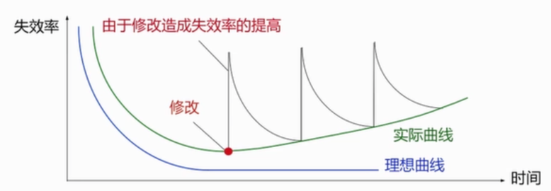

\*\*软件的可变性体现在软件本身的升级，功能的变化等。

\*\*微信的普及（使用量大幅度增加）是从摇一摇开始的。

**不可见性**

1.软件是一种“看不见、摸不着”的逻辑实体、不具有空间的形体特征

2.开发人员可以直接看到程序源代码，但是源代码本身并不是软件本身

3.软件是以机器代码的形式运行，但是开发人员无法看到源代码是如何运行的

\*\*软件的这些特性，使得软件的开发难度增加，我们需要有科学的方法去完成开发过程。

1、什么是软件工程？它有哪些本质特性？

答: 软件工程是指导计算机软件开发和维护的一门工程学科。采用工程的概念、原理、技术和方法来开发与维护软件，把经过时间考验而证明正确的管理技术和当前能够得到的最好的技术方法结合起来，以经济地开发出高质量的软件并有效地维护它。

软件工程本质特性：1、软件工程关注于大型程序的构造；2、软件工程的中心课题是控制复杂性；3、软件经常变化；4、开发软件的效率非常重要；5、和谐地合作是开发软件的关键；6、软件必须有效地支持它的用户；7、在软件工程领域中是由具有一种文化背景的人替具有另一种文化背景的人创造产品。

2、什么是软件生命周期模型？试举例说明3种模型的优缺点及其适用范围。

3、试说明可行性研究的内容至少应该包括哪几个方面。

4、什么是模块的作用域，模块的控制域？它们之间应该建立什么关系？

5、试说明软件测试和调试的联系和区别。

3-1 为什么要进行需求分析?通常对软件系统有哪些需求?

答: 为了开发出真正满足用户需求的软件产品，首先必须知道用户的需求。对软件需求的深入理解是软件开发工作获得成功的前提条件，不论我们把设计和编码工作做得如何出色，不能真正满足用户需求的程序只会令用户失望，给开发者带来烦恼。

确定对系统的综合要求：1、功能需求；2、性能需求；3、可靠性和可用性需求；4、出错处理需求；5、接口需求；6、约束；7、逆向需求；8、将来可以提出的要求，分析系统的数据要求。

1、软件维护的目的和主要任务是什么?维护的类型有哪些?

答:软件维护是软件生命周期中最后一个、持续时间最长的阶段

主要任务是在软件已经交付使用之后,为了改正错误或满足新的需要而修改软件

目的是提高软件的可靠性、可用性,延长软件的寿命

维护的类型有:改正性\(错误\)、适应性\(环境\)、完善性\(功能\)、预防性\(新产品\)

2、什么是耦合?模块的耦合包括哪些类型?

答:耦合是对一个软件结构内不同模块之间互连程度的度量。

模玦的耦合包括以下几种类型:数据耦合,控制耦合,特征耦合,公共环境耦合,内容

耦合,标记耦合,无耦合/非直接耦合

3、什么是内聚?模块的内聚包括哪些类型?

答:内聚标志着一个模块内各个元素彼此结合的紧密程度,它是信息隐蔽和局部化概念的自然扩展

模块的内聚包括以下几种类型:低内聚——偶然内聚,逻辑内聚,时间内聚，中内聚——过程内聚,通信内聚;高内聚——顺序内聚,功能内聚

4、如何选择程序设计语言的工程特性

答:1.系统用户的要求2.可以使用的编译程序3.可以得到的软件工具4.工程规模5程序员的知识6.软件可移植性的要求7软件的应用领域

5、什么是编码风格?为什么要强调编码风格?

答:编码风格包括以下内容:程序内部良好的文档\(注释\)、数据说明、语句构造、输入输出和效率保障等。

因为编码风格对软件的可读性、可维护性、可靠性、可用性很重要,所以要强调编码风格

1、渐增式与非渐增式测试策略各有何优、缺点？为什么通常采用渐增式？

答：1、非渐增式是将所有的模块一次连接起来，简单、易行，节省机时，但测试过程中难于查错，发现错误也很难定位，测试效率低。

2、渐增式是将模块一个一个地连入系统，每连入一个模块，都要对新系统进行测试。这种组装测试方案比较非渐增式，容易查出错误及进行错误定位，有利于查出模块接口部分的错误，因此测试效率高。因此通常采用渐增式。

【评分标准：本题满分5分

非渐增式是将所有的模块一次连接起来（0.5分），简单、易行，节省机时（0.5分），但测试过程中难于查错（0.5分），发现错误也很难定位（0.5分），测试效率低（0.5分）。

渐增式是将模块一个一个地连入系统（0.5分），每连入一个模块，都要对新系统进行测试（0.5分）。这种组装测试方案比较非渐增式，容易查出错误及进行错误定位（0.5分），有利于查出模块接口部分的错误（0.5分），因此测试效率高。因此通常采用渐增式（0.5分）。】

2、基于构件的软件开发的优势是什么？

答：基于构件的软件开发的优势包括：可以显著地改善软件的质量和可靠性；可以极大地提高软件开发的效率；节省软件开发的成本，避免不必要的重复劳动和人力、财力的浪费。

【评分标准：本题满分5分

可以显著地改善软件的质量和可靠性（1分）；

可以极大地提高软件开发的效率（2分）；

节省软件开发的成本（1分），避免不必要的重复劳动和人力、财力的浪费（1分）。】

3、根据模块的作用范围与控制范围的原则，判定a、b两图的正确性，并简单阐述原因。

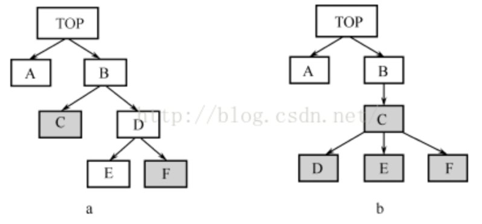

答：显然，图a不满足作用范围应与控制范围的原则，模块F的作用范围不在控制范围之内。 图b的模块设计合理。

【评分标准：本题满分5分

 图a不满足作用范围应与控制范围的原则（2分），模块F的作用范围不在控制范围之内（2分）。 图b的模块设计合理（1分）。

控制范围:是模块本身和它的下属模块的集台。

作用范围:模块中的一个判定影响的所有模块的集合。】

4、为使源程序代码易读易懂，在编写程序时，对标识符的取名和程序注释方面应注意哪些问题？

\(1\) 标识符应按意取名。

     标识符即符号名，包括：模块名、常量名、标号名、子程序名、数据区名、缓冲区名等。 这些名字应能反映它所代表的实际东西，应有一定实际意义，使其能够见名知意，有助于对 程序功能的理解。

     \(2\) 程序应加注释，它分为两类：序言性注释和功能性注释。

     序言性注释应置于每个模块的起始部分，主要内容有：①说明每个模块的用途，功能；②说明模块的接口即调用格式、参数描述及从属模块的清单；③数据描述；④开发历史 。

     功能性注释是嵌在源程序体中的，用于说明其后的程序段或语句的功能以及数据的状态；也就是解释下面要“做什么”，或是执行下面的语句会发生什么情况；而不是解释下面“怎么做”，因为怎么做常常是与程序重复的，且对读者理解程序没有什么帮助。

【评分标准：本题满分5分

  答出标识符应按意取名（1分）。答出标识符按意取名的好处（1分）。

答出程序应加注释（1分），答出注释分为序言性注释和功能性注释（1分）。答出注释的好处（1分）。】

5、简述CMM将软件过程的成熟度分为哪几个级别？以及CMM的主要用途和应用领域。

答：CMM将软件过程的成熟度分为初始级、可重复级、已定义级、已管理级和个优化级。

CMM的主要用途是：用于评估一个组织履行该学科任务的能力。

它的应用领域具体表现在三个方面：

  \(1\) 软件组织：用它来不断改进自身的软件过程管理能力；

  \(2\) 评估机构：用它来评估某软件组织当前软件能力成熟度的级别；

  \(3\) 客户：用它来评价某承包商 \(软件外包商\) 的软件能力。

2、简述原型开发模型、螺旋模型、喷泉模型各自的特点

答：原型模型--优点：

（1）原型系统已经通过与用户交互而得到验证，据此产生的规格说明文档正确地描述了用户需求。

（2）开发人员通过建立原型系统已经学到了许多东西，在设计和编码阶段发生错误的可能性也比较小，这自然减少了在后续阶段需要改正前面阶段所犯错误的可能性。

原型模型—存在的问题

⑴ 为了使原型尽快的工作，没有考虑软件的总体质量和长期的可维护性。

⑵ 为了演示，可能采用不合适的操作系统、编程语言、效率低的算法，这些不理想的选择成了系统的组成部分。

⑶ 开发过程不便于管理。

螺旋模型

需要分析活动结束后才开始设计活动，设计活动结束后才开始编码活动。

优点

（1）对可选方案和约束条件的强调有利于已有软件的重用，也有助于把软件质量作为软件开发的一个重要目标；

⑵减少了过多测试或测试不足；

⑶维护和开发之间并没有本质区别。

特点

（1）风险驱动

⑵主要适用于内部开发的大规模软件项目

⑶要有具有丰富风险评估专门知识的开发人员，否则风险更大。

喷泉模型

喷泉模型的优点： 喷泉模型不像瀑布模型那样，需要分析活动结束后才开始设计活动，设计活动结束后才开始编码活动。该模型的各个阶段没有明显的界限，开发人员可以同步进行开发。其优点是可以提高软件项目开发效率，节省开发时间，适应于面向对象的软件开发过程。

喷泉模型的缺点 

由于喷泉模型在各个开发阶段是重叠的，

因此在开发过程中需要大量的开发人员，因此不利于项目的管理。

此外这种模型要求严格管理文档，使得审核的难度加大，尤其是面对可能随时加入各种信息、需求与资料的情况。

10、模块设计原则？

答：

1.改进软件结构提高模块独立性。

2.模块规模应该适中。

3.深度、宽度、扇出和扇入都应适当。

4.模块的作用域应该在控制域之内。

5. 力争降低模块接口的复杂程度。

6. 设计单入口单出口的模块。

7. 模块功能应该可以预测。

13、总体设计阶段的基本目的是什么？总体设计阶段主要由哪两个小阶段组成的？

总体设计阶段的基本目的是用比较抽象概括的方式确定系统如何完成预定的任务，也就是说，应该确定系统的物理配置方案，并且进而确定组成系统的每个程序的结构。

    总体设计阶段主要由两个小阶段组成。

    首先需要进行系统设计，从数据流图出发设想完成系统功能的若干种合理的物理方案，分析员应该仔细分析比较这些方案，并且和用户共同选定一个最佳方案。

然后进行软件结构设计，确定软件由哪些模块组成以及这些模块之间的动态调用关系。层次图和结构图是描绘软件结构的常用工具。

14、简述软件开发过程、每个里程碑的提交物。

答:软件开发的基本过程:

\(1\)可行性研究,做初步的需求分析工作,决定项目可行与否

\(2\)软件需求分析,软件工程师必须了解软件的信息领域,以及需求的功能、行为、性能和接口。系统需求和软件需求均需文档化,并与用户一起复审。并提交需求分析报告。

\(3\)设计,包括总体设计和详细设计,软件设计是一个多步骤的过程,主要是对软件的数据结构、软件体系结构、界面表示及过程细节进行设计。设计过程将需求转换为软件表示,在编码之前可以评估其质量,所有设计均要文档化,它是软件配置的重要组成部分,经复审后提交相应的概要设计和详细设计报告。

\(4\)编码,把设计转化为机器可执行的程序。提交源程序清单。

\(5\)测试,提交测试报告。

\(6\)维护,提交维护报告。

15、简述软件测试的任务、目的与类型。

答:软件测试是一个为了寻找软件错误而运行程序的过程。

目的就是为了发现软件中的错误。一个好的测试用例是指很可能找到迄今为止尚未发现的错误的用例。一个成功的测试是指揭示了迄今为止尚未发现的错误的测试。软件测试主要分为白盒测试和黑盒测试两大类。

16、简述软件工程目标和面临的主要问题。

答:软件工程的目标是应用计算机科学、数学及管理科学等原理开发软件的工程。它采用经过实践验证的工程的原则、方法,以提高质量,降低成本。

但是目前的软件开发面临着许多问题:\(1\)对软件开发成本和进度的估计常常很不准确。\(2\)用户常对“已完成的”软件系统不满意。\(3\)软件产品的质量往往靠不住。\(4\)软件常常很难维护。\(5\)软件常常缺乏适当的文档资料。\(6\)软件开发生产率提高的速度,远远跟不上计算机应用迅速普及深入的趋势。\(7\)软件成本在计算机系统总成本中所占的比例逐年上升。

36.简述容错技术的四种主要手段,并解释。

36.结构冗余:包括静态冗余、动态冗余和混合冗余。

信息冗余:为检测或纠正信息在运算或传输中的错误,须外加一部分信息。

时间冗余:指重复执行指令或程序来消除瞬时错误带来的影响。

冗余附加技术:指为实现上述冗余技术所需的资源和技术。

38.就程序设计语言的工程特性而言,对程序编码有哪些要求?

答：就程序设计语言的工程特性而言,对程序编码有如下要求:

 \(1可移植性

 \(2开发工具的可利用性

 \(3软件的可重用性

 \(4可维护性

1、试论面向对象方法较之结构化方法的先进性。

**二．分析设计题（本大题共4小题，共70分）**

1. （15分）某网站招聘系统主要功能如下：

（1）接受申请。验证应聘者所提供的自身信息是否完整，是否说明了应聘职位，受理验证合格的申请，给应聘者发送致谢信息。

（2）评估应聘者。根据职位要求，审查已经受理的申请；对未被录用的应聘者进行谢绝处理，将未被录用的应聘者信息存入未录用者表，并发送谢绝决策；对录用者进行职位安排评价，将评价结果存入评价结果表，并发送录用决策，发送录用职位和录用者信息给工资系统。

试给出系统的顶层数据流图和1层数据流图。

2. （15分）下面是插入排序的代码，把R\[i+1\]插入到R\[1..i\]的适当位置。

R\[0\]:=R\[i+1\];

j:=i;

while\(R\[j\]&gt;R\[0\]\)

{ R\[j+1\]:=R\[j\]; j:=j-1; }

R\[j+1\]:=R\[0\];

试画出其对应的程序流程图、N-S图，并计算其McCabe环形复杂度。

3.（20分）计算机信息工程学院属江西师范大学除行政单位之外的下属18个院级教学单位中的一个；学院内部由院党委、行政、教学和科研及学生组成；其中的教学单位又分为5个系；学院的学生由本科生、硕士研究生组成。请设计其对象模型。

4. （20分）某高校教务处需要开发面向全校师生的教务在线系统，试谈谈该系统人机界面设计时应该考虑哪些内容。

1、某电器集团公司下属的厂包括技术科、生产科等基层单位。现在想建立一个计算机辅助企业管理系统,其中

**生产科的任务是:**

\(1\)根据销售公司转来的内部合同\(产品型号、规格、数量、交获日期\)制定车间月生产计划。

\(2\)根据车间实际生产日报表、周报表调整月生产计划

\(3\)以月生产计划为以及,制定产品设计\(结构、工艺\)及产品组装月计划

\(4\)将产品的组装计划传达到各科,将组装月计划分解为周计划,下达给车间

**技术科的任务是**

1\)根据生产科转来的组装计划进行产品结构设计,产生产品装配图给生产科,产生外购需求计划给供应科,并产生产品自制物料清单。

\(2\)根据组装计划进行产品工艺设计,根据产品自制物料清单产生工艺流程图给零件厂。试写出以上系统中生产科和技术科处理的软件结构图。

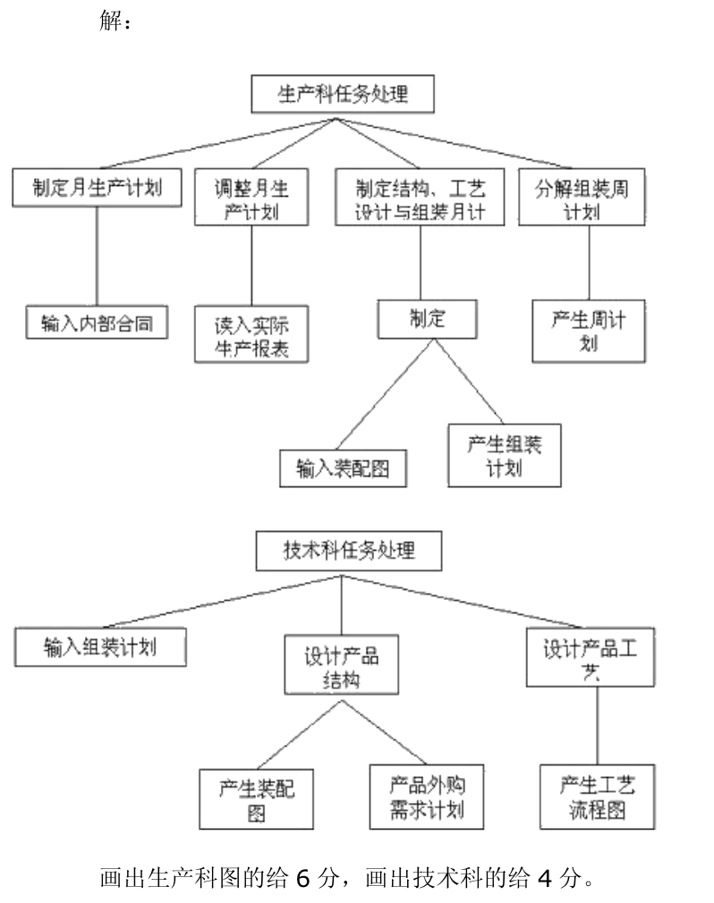

\[解析\]软件结构图是软件系统的模块层次结构,反映了整个系统的功能实现,即将程序的控制层次体系,软件结构往往用树状或网状结构的图形来表示,其主要内容有模块及模块的控制关系,根据题意,可绘制出生产科和技术科的软件结构图,其中生产科的结构图深度和宽度均为4,技术科的结构图的深度和宽度均为3。

五、图a中,模块G为判定,判断涉及到模块B、F、G,请指出设计中的错误,再根据改进模块图的基本原则,画出1~2个改进方案\(不改变模块G的判断关系\),并说明是按照哪条基本原则进行改进的。

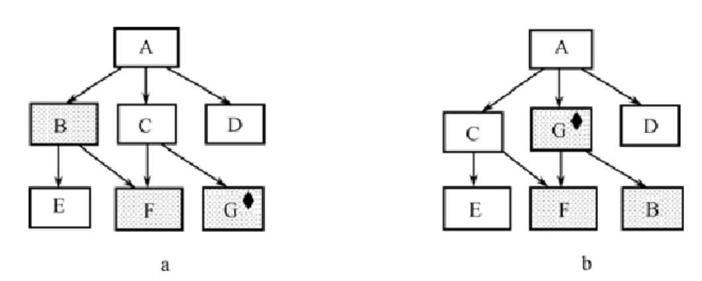

解:图b为一个改进方案,将模块G的位置提高,使其作用范围为控制范围的子集,减少模块之间的联系

40.请使用PAD图和PDL语言描述在数组A\(1\)~A\(10\)中找最大数的算法

解:PDL语言:

N=1

WHILE N&lt;=10 DO

IFA\(N&lt;=A\(N+1\) MAX=A\(N+1\)

ELSE MAX =A \(N ENDIF

=N+1;

ENDWHILE

PAD图:

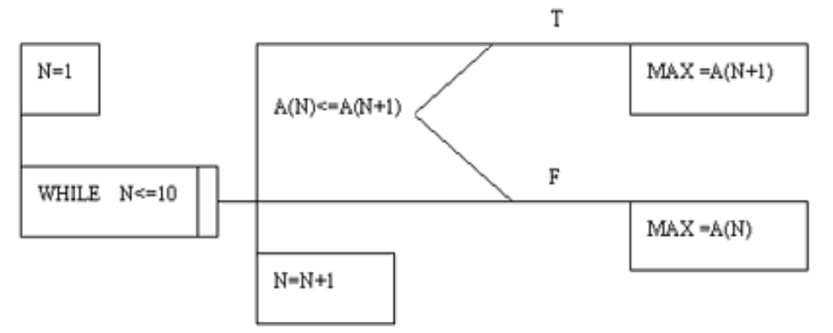

\[解析\]人工査找时,是从第一个元素开始查找,用当前元素与下一个元素比较,将较大者作为当前元素又与下一元素比较,如此循环,直到数组末尾。

41.根据下列条件使用等价类划分法设计测试用例。

某一8位微机,其八进制常薮定义为:以零开头的数是八进制整数,其值的范围是 -177 ~ 177, 如05,0127,-065

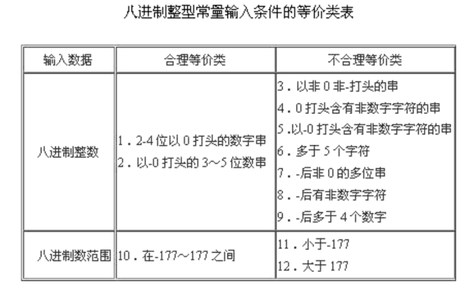解:\(1\)划分等价类并编号,如下表示:\(4分\)

 \(2\)为合理等价类设计测试用例,表中有两个合理等价类,设计两个例子\(2分\)

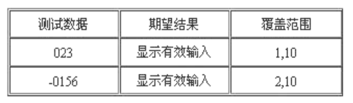

\(3\)为不合理等价类测试用例,至少设计一个测试用例\(2分\)

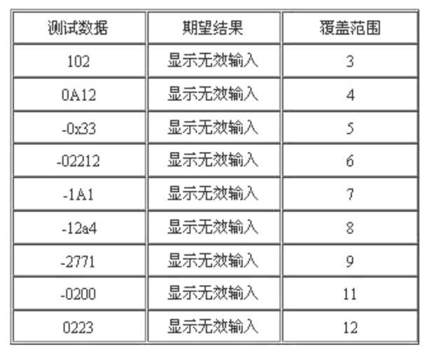

\[解析\]等价类划分属于黑盒测试的一种,它将输入数据域按有效的或无效的划分成若干个等价类,测试每个等价类的代表值就等于对该类其他值的测试,这样用少量有代表性的例子代替大量测试目的相同的例子,可以有效提高测试效率。本题划分了3个合理等价类,9个不合理等价类进行测试,取到了预期的效果。

2、画出下列伪码程序的程序流程图和盒图\(10分\)

START

IF  p  THEN

     WHILE  q  DO

                   f

     END  DO

ELSE

     BLOCK

     g

     n

     END  BLOCK

END  IF

STOP

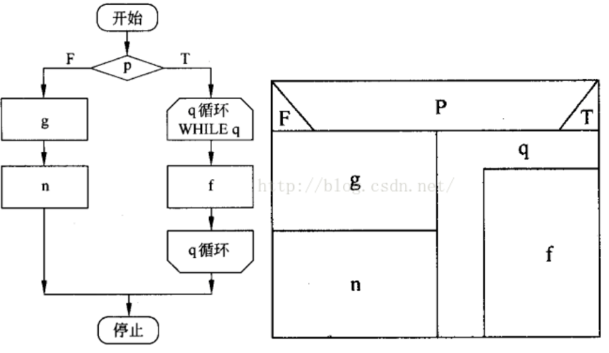

1.某“调整工资”处理模块接受一个“职称”的变量，根据职称的不同（助教，讲师，副教授，教授）作不同的处理，其中若是助教还必须输入工龄，只有工龄超过两年才能调整工资。请用等价类划分法设计测试用例。

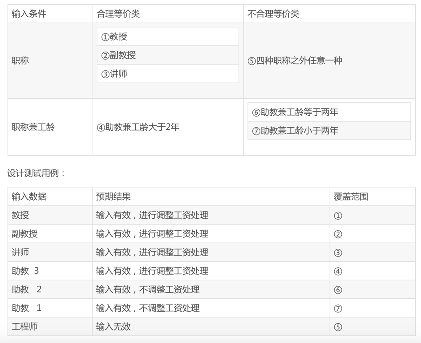

2.假定某航空公司规定，乘客可以免费托运重量不超过30公斤的行李。当行李重量超过30公斤时，对头等舱的国内乘客超重部分每公斤收费4元，对其它舱的国内乘客超重部分每公斤收费6元，对国外乘客超重部分每公斤收费比国内乘客多一倍，对残疾乘客超重部分每公斤收费比正常乘客少一半。用判定树表示计算行李费的算法。

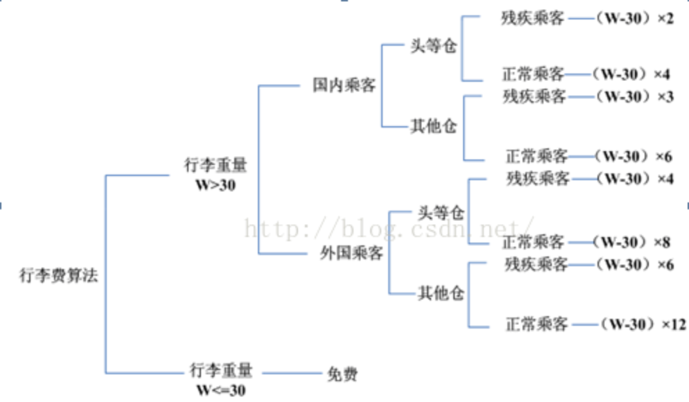

